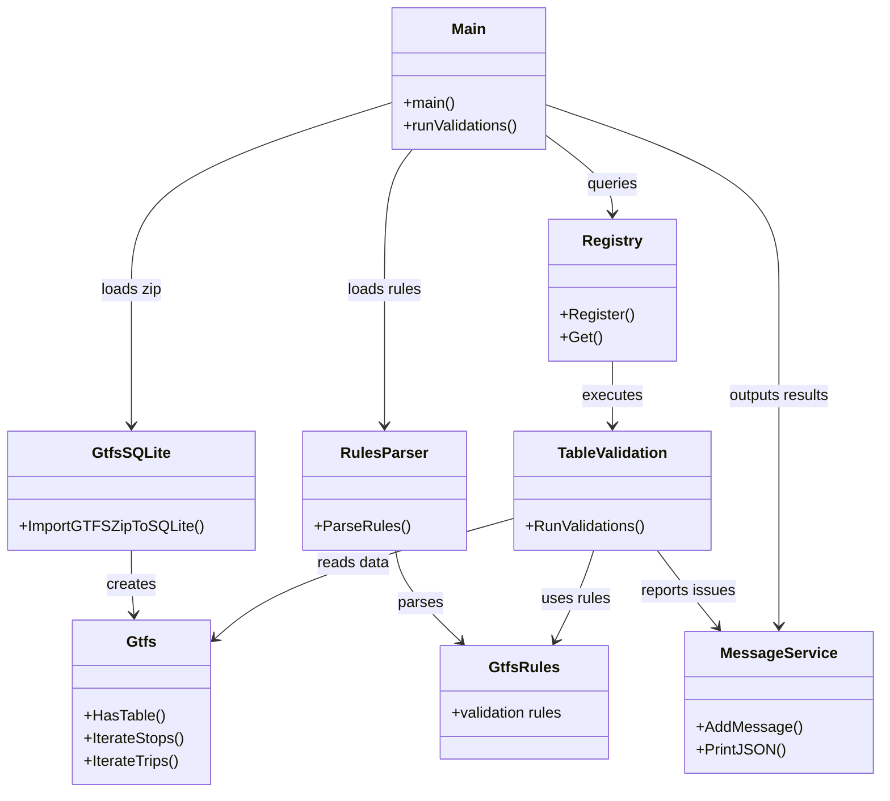

# GTFS Validator

A high-performance GTFS (General Transit Feed Specification) validation tool written in Go. The validator processes GTFS feeds, applies configurable validation rules, and reports errors and warnings in a structured format.

## Architecture Overview

The GTFS Validator follows a modular, concurrent architecture designed for efficiency and extensibility. The system is organized into several key components:

### Core Components

1. **GTFS Loader** - Handles reading and parsing GTFS zip files
2. **SQLite Storage** - Stores GTFS data in a temporary SQLite database for efficient access
3. **Validation Registry** - Manages registration and discovery of validation functions
4. **Rules Engine** - Processes configurable validation rules from JSON files
5. **Message Service** - Collects and aggregates validation results
6. **Validation Context** - Provides common utilities for validation functions

### High-Level Flow

```
GTFS Zip File → SQLite Import → File Validation → Table Validations (Concurrent) → Results Output
```

### Architecture Diagram



## GTFS Loading Process

The validator uses SQLite as an intermediate storage layer to efficiently handle large GTFS feeds without loading everything into memory.

### Step 1: Zip File Reading

The process begins when `ReadGTFSZip()` is called with a path to a GTFS zip file:

1. **Temporary Database Creation**: A temporary SQLite database file is created to store the GTFS data
2. **Database Configuration**: The SQLite database is configured with:
   - WAL (Write-Ahead Logging) mode for better concurrency
   - Optimized pragmas for performance (synchronous=NORMAL, temp_store=MEMORY)
   - Single connection pool to serialize writes and avoid locking issues

### Step 2: File Processing

Each file in the GTFS zip archive is processed sequentially:

1. **File Filtering**: Only known GTFS files (defined in `config.GTFSFiles`) are processed
2. **CSV Parsing**: Each `.txt` file is read as CSV with:
   - UTF-8 BOM removal
   - UTF-8 encoding validation
   - Header row extraction
3. **Table Creation**: SQLite tables are created dynamically based on CSV headers
4. **Batch Insertion**: Rows are inserted in batches using transactions for performance
5. **ID Mapping**: Primary keys are indexed in a separate `id_map` table for fast lookups

### Step 3: Data Structure Creation

After all files are imported:

1. **Gtfs Struct**: A `Gtfs` struct is created with a connection to the SQLite database
2. **ID Map Loading**: The ID map is loaded into memory for fast primary key lookups
3. **Iterator Methods**: The `Gtfs` struct provides iterator methods (e.g., `IterateStops()`, `IterateTrips()`) that stream data from SQLite

### Benefits of SQLite Storage

- **Memory Efficiency**: Large feeds don't need to be fully loaded into memory
- **Fast Queries**: SQLite provides efficient querying and indexing
- **Concurrent Access**: Multiple validations can read from the database concurrently
- **Temporary Storage**: The database is automatically cleaned up after validation completes

## Validation Processing

The validation system uses a registry pattern that allows validation functions to be registered and discovered automatically.

### Validation Registry

The `validations.Registry` maintains a thread-safe map of table names to validation functions:

- **Registration**: Each validation package registers itself during `init()` using `validations.Register(tableName, validationFunction)`
- **Discovery**: The main validation loop looks up validation functions by table name
- **Thread Safety**: The registry uses read-write mutexes to support concurrent access

### Validation Execution Flow

1. **Rules Parsing**: Validation rules are loaded from a JSON file (if provided) and parsed into a `GtfsRules` structure
2. **File Validation**: Basic file-level validations run first (required files, forbidden files, conditional requirements)
3. **Table Validation**: For each GTFS table:
   - Check if the table exists in the database
   - Look up the registered validation function
   - Execute the validation function in a separate goroutine
4. **Concurrent Execution**: All table validations run concurrently using goroutines and a `sync.WaitGroup`
5. **Completion**: The system waits for all validations to complete before proceeding

### Validation Function Signature

Each validation function follows this signature:

```go
func(gtfs types.Gtfs, rules *types.GtfsRules)
```

- **gtfs**: Provides access to the GTFS data via iterator methods and database queries
- **rules**: Contains the validation rules for the specific table being validated

### Validation Context

The `ValidationContext` struct provides common utilities for validation functions:

- **Severity Management**: Checks if a validation should be ignored or if a field is forbidden
- **Message Creation**: Standardized message creation with proper formatting
- **Translation Support**: Access to internationalized error messages
- **Row Tracking**: Tracks which rows have validation issues

## Results Collection and Output

### Message Service

The `MessageService` collects all validation messages throughout the execution:

- **Message Aggregation**: Messages are collected with metadata (file name, field, row numbers, severity)
- **Deduplication**: Duplicate messages are merged, keeping track of all affected rows
- **Severity Tracking**: Maintains counts of errors and warnings
- **Early Exit**: Can exit early if too many issues are detected (configurable limit)

### Output Formats

The validator supports multiple output formats:

1. **JSON Output**: Structured JSON output with all messages and summary statistics
2. **File Output**: Results can be written to a file using the `-out` flag
3. **Console Output**: Results are printed to console by default

### Message Structure

Each validation message contains:

- **ValidationID**: Unique identifier for the validation rule
- **Message**: Human-readable error or warning message
- **Severity**: ERROR, WARNING, or IGNORE
- **FileName**: The GTFS file being validated
- **Field**: The specific field being validated
- **Rows**: Array of row numbers (1-indexed, accounting for header row) where the issue occurs

## Configuration

### Command-Line Options

- `-input`: Path to the GTFS zip file (required)
- `-rules`: Path to the validation rules JSON file (optional)
- `-out` / `-o`: Path to write output file (optional)
- `-log`: Log level (debug, info, error)
- `-lang`: Language for error messages (en, pt)

### Rules File Format

The rules file is a JSON structure that defines validation severity levels for each GTFS table and field. Each field can have:

- **Severity**: ERROR, WARNING, IGNORE, or FORBIDDEN
- **Options**: Allowed values for the field
- **Compare**: Comparison rules for cross-field validation

## Performance Considerations

- **Concurrent Validations**: Table validations run concurrently to maximize CPU utilization
- **Streaming Access**: Data is streamed from SQLite rather than loaded entirely into memory
- **Batch Processing**: Database operations use batch transactions
- **Early Termination**: Can exit early if too many validation errors are detected
- **Progress Tracking**: Large tables show progress indicators during validation

## Cleanup

After validation completes:

1. The SQLite database connection is closed
2. The temporary database file is removed
3. Results are output in the requested format

This ensures no temporary files are left behind after validation completes.

